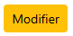
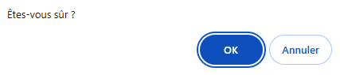
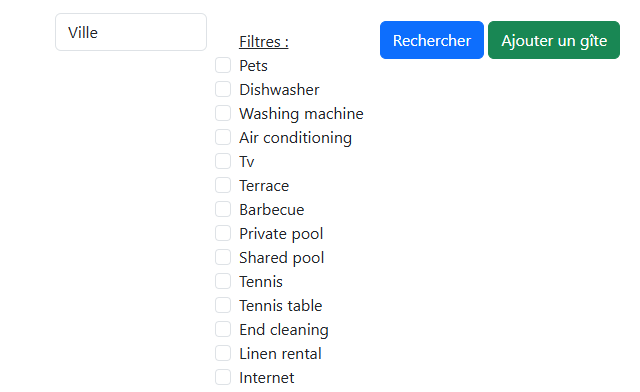
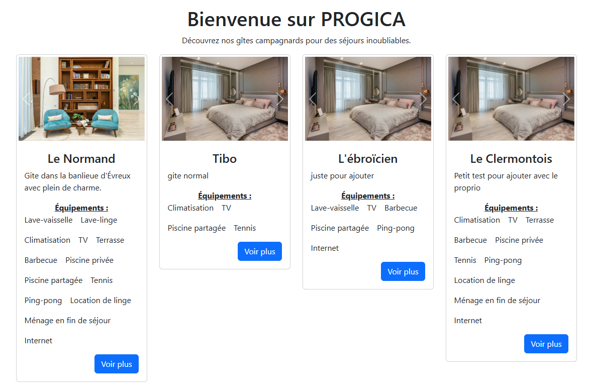
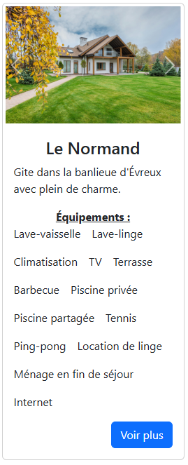
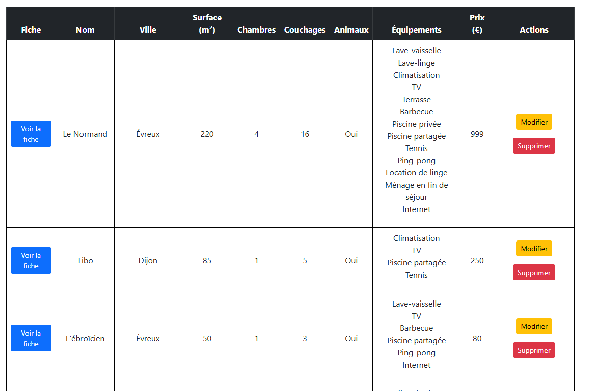

# Cas d'utilisation

## Création d'un nouveau gîte

**Description** : Un utilisateur peut créer un nouveau gîte en remplissant les informations demandées dans un formulaire.

1. L'utilisateur doit accéder à la liste des gîtes.
2. Il accède à la page de création d'article à l'aide de .
3. Il remplit les champs du formulaire.
4. Il soumet le formulaire grâce à .
5. Le gîte est sauvegardé dans la base de données.

## Modification d'un gîte

**Description** : L'utilisateur peut modifier un gîte existant.

1. L'utilisateur sélectionne le gîte à modifier en utilisant .
2. Il modifie le contenu en remplissant simplement les champs à modifier.
3. Il enregistre les modifications à l'aide de .

## Suppression d'un gîte

**Description** : L'utilisateur peut supprimer un gîte existant.

1. L'utilisateur se rend sur la liste.
2. Il recherche le gîte qu'il souhaite supprimer.
3. À l'aide de , il demande la suppression du gîte.
4. Une boîte de dialogue s'affiche, il ne lui reste qu'à valider, ou non, sont choix. 

## Recherche d'un gîte

**Description** : L'utilisateur peut rechercher un gîte existant par ville ou par équipement présent dans le gîte.

1. L'utilisateur se rend sur la liste.
2. Il recherche le gîte à l'aide des options de recherche présente au-dessus de cette liste. 
3. La liste se met à jour une fois  utilisé.

## Accéder à la fiche d'un gîte

**Description** : L'utilisateur peut accéder à la fiche d'un gîte afin d'avoir accès à toute la description du gîte.

### Méthode 1

1. Depuis l'écran d'accueil. 
2. Chacun des gîtes répertoriés est représenté par une carte d'information. 
3. Il suffit d'utiliser le bouton  afin d'accéder à la fiche.

### Méthode 2

1. Depuis la liste. 
2. Chacun des gîtes répertoriés est représenté, après utilisation de la fonctionnalité de recherche ou non.
3. Il suffit d'utiliser le bouton  afin d'accéder à la fiche.
